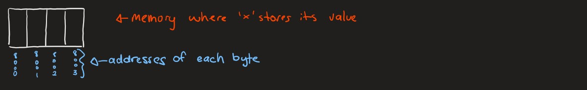

# Lecture 4 - 6/3/2022

## Shooting an `xterm`

By running the command:

``` bash
xterm &
```

You will see that a new window shoots so you can have another window to work with grace.

This is possible because of the `xserver` that is installed with `MobaXTerm` or `XQuartz`. An `xserver` allows you to have graphical interfaces through SSH.

## Customizing an `xterm`

These can by customized using flags such as:
* `-fa licudatypwriter` to set the font to lucudatypewriter
* `-fs 10` to set the font size to 10
* `-fg white` to set the foreground to white
* `-bg black` to set the background to black 

Using `xterm`s can allow you to edit files and run them in different windows.

### `xclock`

The command

``` bash
xclock
```

Shoots a GUI of a clock. It's a crappy clock but it's still a clock. If you put an `&` after an `xserver` command such as this, you'll still be able to use the command line.

## File Editor: `kate`

Kate is a file editor available on Grace. It's faster than `emacs` and it seems to be user friendly. 

Kate is local to Grace, so you know it'll work. Nelson has been playing with VS Code, but it's messy and he doesn't want us to waste time on it instead of learning C and stuff.

## Types in C

There are differnt types in C, each with different numbers of bytes. For example, `int` and `long` have a different number of bytes. The number of bytes can be different depending on the environment that the program is compiled and run on.
* The only type with a consisted number of bytes is `char`.
   * The `char` type is also sometimes called the `byte` type because we'll see that it gives us the ability to traverse bytes.

Warning from Nelson: "Do not mix or randomly cast types unless you know what you're doing"

### Example: `mixed_types_1.c`

These examples come from experiences where students were spending lots of time debugging issues that pertained to misusing types:

``` c
#include <stdio.h>

int main() {
   int x = 2000000000; /* value fits in x */
   long result_long;

   printf("Value of x: %d\n", x);
   printf("Multiplying by 3 (with %%d format): %d\n", 2000000000 * 3);
   printf("Multiplying by 3 (with %%ld format): %ld\n", 2000000000 * 3);
   printf("Multiplying by 3L (with %%d format): %d\n", 2000000000 * 3L);
   printf("Multiplying by 3L (with %%ld format): %ld\n", 2000000000 * 3L);

   result_long = 2000000000 * 3;  /* Does it solve the problem? */
   printf("Storing result in long type variable: %ld\n", result_long);

   return 0;
}
```
In this code, we try to take 2 billion, and multipy it by three, then print it. The problem here, is that the `int` in our system can accomodate 2 billion, but not 6 billion. This is because we don't have enough bytes in an `int` to hold the value of 2 billion. 
* Could this be because of the conversion specifier (`%d`, `%f`, etc.)?
   * The conversion specifier looks at a set of bytes and interprets them as a certain type, such as `int` or `double` or `char` or `float`. 

Let's take a look at the output of this code:

``` ]
grace7:~/216/lecture_examples/Week01/C-Language-III-Code: a.out
Value of x: 2000000000
Multiplying by 3 (with %d format): 1705032704
Multiplying by 3 (with %ld format): 1705032704
Multiplying by 3L (with %d format): 1705032704
Multiplying by 3L (with %ld format): 6000000000
Storing result in long type variable: 1705032704
```

As you can see, we only get the correct answer once. This is because the result of `2000000000 * 3L` is correctly interpreted as a `long`. In the other tries, either the result was stored as an `int`, which is too small to hold the value of 6 billion, or the result was interpreted as an `int` even when the result was a `long`.

The stored result is also incorrect because the operation was done with `int`s, and stored in a space interpreted as a `long`.

### Example: `mixed_types_2.c`

This code empahsizes a thing called "testing":

``` c
#include <stdio.h>

int main() {
   unsigned int value = 250;  /* try with 250 and 4000000000 */

   printf("\nType sizes\n");
   printf("sizeof(unsigned int): %ld\n", sizeof(unsigned int));
   printf("sizeof(int): %ld\n", sizeof(int));
   printf("sizeof(long): %ld\n\n", sizeof(long));

   printf("value: %u\n", value);
   printf("(int)value: %d\n", (int)value);
   printf("(long)value: %ld\n", (long)value);

   printf("(int)value / 4: %d\n", (int)value / 4);
   printf("value / 4: %d\n", value / 4);

   return 0;
}
```

Let's also take a look at its output:

```
grace7:~/216/lecture_examples/Week01/C-Language-III-Code: a.out

Type sizes
sizeof(unsigned int): 4
sizeof(int): 4
sizeof(long): 8

value: 250
(int)value: 250
(long)value: 250
(int)value / 4: 62
value / 4: 62
```

As we can see, we can see how many bytes a type uses with the `sizeof()` operator. 

An `unsigned int` is an `int` with no negative values.
* This is useful in cases where we will not be using negative values in our calculations. This way, we will have a larger range of intergers available with the type.

### Casting

When we cast a variable, the compiler performs the calculations necessary to transform the data stored as one type into data that can be interpreted as the new type.
* For example
   * `double`'s decimals will be chopped off to become `int`
   * `char` will be changed into ASCII version of `int` for `int`

Although we get the expected answers, we aren't actually performing these calculations correctly. We can see this by testing using a value of `4000000000` instead of `250`. When we change the value of that variable, the output changes:

``` poop
grace7:~/216/lecture_examples/Week01/C-Language-III-Code: a.out

Type sizes
sizeof(unsigned int): 4
sizeof(int): 4
sizeof(long): 8

value: 4000000000
(int)value: -294967296
(long)value: 4000000000
(int)value / 4: -73741824
value / 4: 1000000000
```

As we can see, we have values that are negative, even though we wouldn't expect any of these values to be negative. To understand why this is, we need to know what happens behind the scenes. The reason why it doesn't work in this case is because an `int` is different from an `unsigned int`. Since `int`s have negative numbers, their data is interpreted differently than `unsigned int`s, thereby leading to this type of error.

### Example: `mixed_types_3.c`

Take a look at this example code:

```c
#include <stdio.h>
#include <string.h>

static void process(const char *str) {
   size_t k, value = 2;
   size_t delta = strlen(str) - value; /* problem: possible negative */
   int answer_is_yes;                  /* value assigned to delta (unsigned) */
   char c;

   printf("Delta value: %ld\n", delta);
   printf("Enter \"yes\" to continue: ");
   answer_is_yes = scanf("ye%c", &c);
   if (answer_is_yes == 1) {
      for (k = 0; k < delta; k++) {
         printf("In loop %ld\n", k);
      }
   }
}

int main() {
  process("house");   /* problem when using "a" */

  return 0;
}
```

Let's also see the output of this code:

``` 
grace7:~/216/lecture_examples/Week01/C-Language-III-Code: a.out
Delta value: 3
Enter "yes" to continue: yes
In loop 0
In loop 1
In loop 2
```

This program checks the size of the string and then loop from 0 to 2 less than that string length. The problem here arises when the word is is less than 2 characters long. In this case, we will see an infinite loop, because the loop's iteration variable never reaches `delta`, which is negative.

Also, the datatype `size_t` is an `unsigned int`, so it cannot properly hold negative values. 

As you can see, it's important to be careful of the types used for values that might be negative.

Here is the fixed version, `mixed_types_3_fixed.c`:

``` bash
grace6:~/216/lecture_examples/Week01/C-Language-III-Code: cat mixed_types_3_fixed.c
```
``` c
#include <stdio.h>
#include <string.h>

static void process(const char *str) {
   long int k, value = 2;
   long int delta = (long int)strlen(str) - value;
   int answer_is_yes;
   char c;

   printf("Delta value: %ld\n", delta);
   printf("Enter \"yes\" to continue: ");
   answer_is_yes = scanf("ye%c", &c);
   if (answer_is_yes == 1) {
      for (k = 0; k < delta; k++) {
         printf("In loop %ld\n", k);
      }
   }
}

int main() {
  process("house");   /* problem when using "a" */

  return 0;
}
```

As we can see, the solution to this infinite loop problem is to use `long int` to store values that may be negative.  

## Switching Between Clusters

You can switch from one node to another node within the Grace cluster by `ssh`ing to another node within the Grace cluster. This may help if there are many people on one node.

For example

``` bash
ssh grace4 
```

will put you on the `grace4` node. This can be useful when many people are on one node, which may slow it down. In this case, `ssh`ing into a node with less people can be faster.

## The `sizeof` operator
* Unary **operator**, evaluates to the number of bytes necessary to hold its operand
* Operand can be an expression or a type name
    * It does NOT evaluate the expression
* Example:
   * Let's say 
     ``` c
     int i = 5;
     ```
   * we can use `sizeof()` like this:
      * ``` c
        printf("%ld\n", sizeof(i));
        ```
      * ``` c
        printf("%ld\n", sizeof(unsigned char));
        ```
      * ``` c
        printf("%ld\n", sizeof(++i));
        ```
         * here, the value of `++i` will **NOT** evaluated. Instead, we will see the size of this operation. So, the value of `i` will **not** change.
      * ``` c
        printf("%d\n", i);
        ```

## Pointers

* Pointer -> memory address, address, reference are equivalent terms
* **Pointer variable** -> Variable whose value is an address
    * Informally we call a pointer variable a pointer, but that can be misleading (similar to calling an integer variable an integer)
* A **pointer variable** has a fixed number of bytes as an address in a system has a fixed number of bytes
* A **pointer variable stores** the address of the first byte of an int, float, double, etc. Not the whole address; just the address of the first bye
* **Let’s see a diagram**
* A pointer variable is defined as follows:
  ```js
  <TYPE><ZERO_OR_MORE_SPACES>*<ZERO_OR_MORE_SPACES><VARIABLE_NAME>;
  ```
* Example: `int*ip;`
    * Creates a variable called ip whose type is "pointer to int“
* All the following are equivalent:
  ```c
  int*p; /* no spaces */
  int* p; /* helps emphasize p is a “variable that stores address of int */
  int * p;
  int *p; /* the one we prefer */ /* see man 3 scanf in linux */
  ```
* Obtaining the address of an lvalue (&)
    * Placed before a variable (or an lvalue)
    * **Returns the address of the first byte**
* Accessing the entity at an address (*)
    * Placed before an expression which is either a pointer variable or otherwise evaluates to a pointer
    * **Returns the entity that lives at the specified address**
    * Confusing as same symbol (*) used to define a variable as a pointer variable and to dereference

### Written Example

To further explain the concept of pointers, let's define a variable `x`:

``` c
int x;
```

This variable `x` represents a value in memory. We can represent this space of memory with this drawing:



In this memory, we can see that there are four bytes next to each other that hold the value of this variable `x`. The addresses of these bytes, `8000`, `8001`, `8002`, and `8003`, have been chosen randomly for the purposes of this example but they're still next to each other and have incremental memory addresses.

``` c
/////////////////////////////////// here ///////////////////////////////////////
```

### Example: `reading.c`

Take a look at this code that shows the usage of pointers

```c
#include <stdio.h>

int main() {
   int age, values_read;
   int* age_ptr = &age;
   float salary;

   printf("Enter your age and salary (using <age>-<salary> format): ");

   /* This example shows we don't always use & in variables of a scanf */
   values_read = scanf("%d-%f", age_ptr, &salary);
   if (values_read != 2) {
      printf("Invalid data provided\n");
   } else {
      printf("Provided values Age: %d, Salary: $%.2f\n", age, salary);
   }

   return 0;
}
```