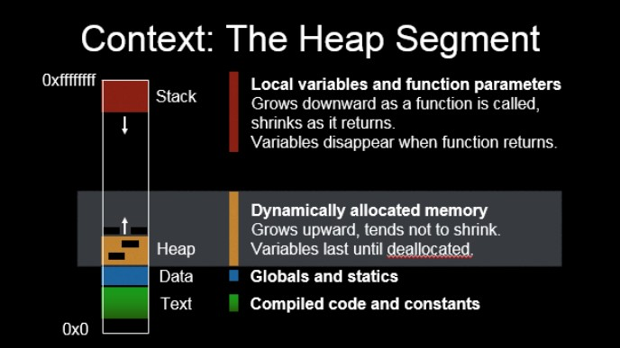

# Lecture 2 - 6/2/2022

## Hidden Files

Hidden files begin with a period. A period represents the current directory. To see hidden files, use this command:
``` bash
`ls -al`.
```
* If you do this in your home directory, you will see that there are many configuration files. In my case, I have all this:
  ``` bash
  total 61
  drwxr-xr-x. 8 sprakash users 2048 Jun  2 21:26 .
  drwxr-xr-x. 7 root     mail  2048 May 25  2021 ..
  lrwxr-xr-x. 1 sprakash users   58 May 31 21:41 216 -> /afs/glue/class/summer12022/cmsc/216/0101/student/sprakash
  lrwxr-xr-x. 1 sprakash users   48 May 31 21:41 216public -> /afs/glue/class/summer12022/cmsc/216/0101/public
  -rw-r--r--. 1 sprakash users  282 May 31 22:05 .aliases
  -rw-r--r--. 1 sprakash users  178 May 25  2021 .bash_aliases
  -rw-r--r--. 1 sprakash users  573 May 25  2021 .bash_environment
  -r--r--r--. 1 sprakash users 1538 May 25  2021 .bash_logout
  -rw-r--r--. 1 sprakash users  256 May 25  2021 .bash_logout.mine
  -rw-r--r--. 1 sprakash users  303 May 25  2021 .bash_path
  -r--r--r--. 1 sprakash users 2387 May 25  2021 .bashrc
  -rw-r--r--. 1 sprakash users  353 May 25  2021 .bashrc.mine
  -r--r--r--. 1 sprakash users 2352 May 25  2021 .cshrc
  -rw-r--r--. 1 sprakash users  420 May 31 21:41 .cshrc.mine
  -rw-r--r--. 1 sprakash users 1664 May 25  2021 .dashmenurc
  drwx------. 3 sprakash users 2048 Jun  2 01:57 .dbus
  -rw-r--r--. 1 sprakash users  498 May 25  2021 .emacs
  drwx------. 3 sprakash users 2048 Jun  1 15:49 .emacs.d
  -rw-r--r--. 1 sprakash users  534 May 25  2021 .environment
  -rw-r--r--. 1 sprakash users   95 May 25  2021 .fvwm2rc
  -rw-------. 1 sprakash users  613 Jun  2 21:26 .history
  -rw-r--r--. 1 sprakash users    0 Jun  2 21:26 .hushlogin
  drwxr-xr-x. 3 sprakash users 2048 Mar 16  2006 .kde
  -rw-r--r--. 1 sprakash users   86 May 25  2021 .kermrc
  drwxr-xr-x. 3 sprakash users 2048 May 31 11:34 .local
  -r--r--r--. 1 sprakash users 1761 May 25  2021 .login
  -r--r--r--. 1 sprakash users 1524 May 25  2021 .logout
  -rw-r--r--. 1 sprakash users  258 May 25  2021 .logout.mine
  drwx------. 2 sprakash users 2048 May 25  2021 Mail
  -rw-r--r--. 1 sprakash users   11 May 25  2021 .mh_profile
  -rw-r--r--. 1 sprakash users  370 May 31 21:41 .path
  -r--r--r--. 1 sprakash users 1757 May 25  2021 .profile
  -rw-r--r--. 1 sprakash users  118 May 25  2021 .reqrc
  drwx------. 2 sprakash users 2048 Jun  2 21:25 .ssh
  -rwxr-xr-x. 1 sprakash users  835 May 25  2021 .startup.X
  -rw-r--r--. 1 sprakash users  613 May 25  2021 .twm.menus
  -rw-r--r--. 1 sprakash users 1609 May 25  2021 .twmrc
  -rw-------. 1 sprakash users  912 Jun  2 02:39 .viminfo
  -rw-r--r--. 1 sprakash users  954 May 17  2006 welcome
  -rw-------. 1 sprakash users  481 Jun  2 21:25 .Xauthority
  -rwxr-xr-x. 1 sprakash users 1269 May 25  2021 .xinitrc
  -rwxr-xr-x. 1 sprakash users  132 May 25  2021 .xserverrc
  lrwxr-xr-x. 1 sprakash users    8 May 25  2021 .xsession -> .xinitrc
  ```
  Dang that's a lot of files that I didn't know about.

The command `pwd` shows the path of where you are.

## Input and Output

Let's create a sample file `p1.c` such that:

``` c
#include <stdio.h>

int main(void) {
    int x, y;

    scanf("%d%d", &x, &y);
    printf("The values are %d %d\n", x, y);

    return 0;
}
```

We can compile this program using `gcc` and run it such that this will be our output:

```
10 20
The values are 10 20
```

### Input Redirection

Let's try to change the input from the user to a file. To do this, lets create a file using the command

``` bash
vi data.txt
```

Here, we will put this data in:

```
10 20
```

So now, the file `data.txt` contains the text `10 20` that represents our data.

To run our program using this file as our input, we can run this command:

``` bash
a.out < data.txt
```

When we do this, our terminal shows:

``` bash
grace7:~/216: a.out < data.txt
The values are 10 20
```

Notice I left in the command line to show everything I've done for this run.

What we have done here is called **input redirection**.

### Output Redirection

We can also redirect our ouptut from the CLI to a file. To do this, we could run the program like this:

``` bash
grace7:~/216: a.out < data.txt > results.txt
```

This way, the program's input is `data.txt`, and the output goes to a file called `results.txt`. Using `ls`, we can see that the file `results.txt` was created.

When we run the command 

``` bash
cat results.txt
```
we will see the output of our program in the `results.txt` file:

``` bash
grace7:~/216: cat results.txt
The values are 10 20
```

Note: before we run this program againl, we must remove the `results.txt` file using this command:

``` bash
rm results.txt
```

## Exercise: `draw_figures`

In `216public/exercises/draw_figures/`, we see many files.

``` bash
grace7:~/216public/exercises/draw_figures: ls
colors_in_c.c    public02.output  public04.output  public06.output
public01.in      public03.in      public05.in
public01.output  public03.output  public05.output
public02.in      public04.in      public06.in
```

These are the files that show the inputs and exptected outputs of our program.

When we work on this exercise, we can use input and output redirection to run out program like this:

``` bash
a.out < public01.in > t
```

where t is our output file.

### Command: `diff`

In our environment, there is a command which can compare two files. Suppose we want to see if a file `r` is the same as a file `public01.out`. We can run the command:

``` bash
diff public01.output r
```

If there is no output from this line, then the two files are identical. Otherwise, it will tell you what the difference is.

This command will help us to see if the output from our program matches the expected output as shown in files such as `public01.output` and `public02.output`.

## Transfer Files to and from Grace

In MobaXTerm, you can transfer files to and from Grace by using the `SFTP` feature. Do this by:
* Go to `Sessions` dropdown in the menu bar
* Hit `New Session`
* Click `SFTP`
* After logging in this way, you will see that you can drag and drop files like Windows File Explorer

Mac Users can use transfer files using another protocol.'

### File Transfer Protocol: `scp` (secure copy)

I use `scp` to copy files through SSH on different machines. To do this on Grace, open a terminal on your local machine. Enter a command that follows this structure: 

```  
scp -P 22 sprakash@grace.umd.edu:~/216/p1.c ./Desktop/p1.c
```
obiously, change my username to yours, the path of the file to the path of your file, the name of the file to the name of your file, and the path for where you want the file to wherever you wish for it to be.

Alternatively, you can open your local terminal in wherever you want the file to go. Then you don't need to write the path for where you want the file to go, only the file name.

For example, this also works:

```
C:\Users\Sashu\Desktop>scp -P 22 sprakash@grace.umd.edu:~/216/p1.c p1.c
```

## Why you want to develop your own code?

Copied from `C-Language-III.pdf` slides

* “Company TA” - Remember there is no such thing as the “company ta” you need to develop the skills you will need later on (both for classes and future employer)
* Constant Help - It is OK to be assisted by TAs, but if you are constantly asking for TA help it is best if you talk to us to address any problems you might be experiencing
* Debug Your Own Programs - You are expected to debug your own programs. We will help you, but you need to do most of the work
* Skills Will Develop The More Independent You Are - Your programming skills will increase as you rely less and less on TAs
* Exams and quizzes will have questions based on your projects. If you don’t complete the projects by yourself you will not be able to answer those questions
* Please read the information available [here](http://www.cs.umd.edu/~nelson/classes/resources/writingComputerPrograms/).

## Incremental code development

Copied from `C-Language-III.pdf` slides

* **Most important rule for code development** – Regardless of the language you are using, **incremental code development** (add code, test, then add more) it is extremely important
* You will know if you are following incremental code development if you
can answer the following questions:
    1. Up to what point my code was working?
    2. What did I added that just made my code stop working?
* Compiler can generate errors that are hard to interpret
* Look at the number of errors for the following program when compiled using the gcc settings for the course

### Example: `error.c`

This example code shows why incremental code development is important.

```c
// Mary
#include <stdio.h>
int main() {
    printf("Done\n");
    return 0;
}
```

When we compile this code using `gcc`, it outputs several large error messages. It's difficult to comprehend all this, so if we made sure to test our program at each increment of development, we can find the cause of problems easier, since not much will have changed.

## Comma operator

Copied from `C-Language-III.pdf` slides

* Yes, the comma is an operator
* Evaluates left operand, then right operand
* Value of expression with commas is the value of the last operand
* Comma operator has lowest precedence of all operators
* For the following code, what gets stored in `i` after each statement? What does each statement evaluate to?
  ```
  i = 1, 2, 3, 4;
  i = (1, 2, 3, 4);
  ```

### Example: `comma_op.c`

Take a look at this code which shows what the comma operator does:

``` c
#include <stdio.h>

int main() {
   int i, j = 2, k = 3;

   i = (1, ++j, ++k);
   printf("i: %d\n", i);
   printf("j: %d\n", j);
   printf("k: %d\n", k);

   /* Resetting j, k */
   printf("\nWithout parentheses\n");
   j = 2;
   k = 3;
   i = 1, ++j, ++k;
   printf("i: %d\n", i);
   printf("j: %d\n", j);
   printf("k: %d\n", k);

   return 0;
}
```

As you can see, the line

``` c
i = (1, ++j, ++k);
```

Has three instructions, separated by commas, and this is somehow evaluated to a value that is given to `i`. The comma operator returns the value of the last expression, in this case, `++k`. So, `i` will have whatever value results from `++k`.

On the other hand, when used without parenthasis such as

``` c
i = 1, ++j, ++k;
```

`i` is given the value of 1, and the other statements also run. The values of those statements are useless in that line because `i` is not affected by them.

## C Program memory organization

Copied from `C-Language-III.pdf` slides



## Identifier scope
* C has two main types of scope
    * **Block scope**: a variable declared inside a block is visible only within the block (includes nested blocks inside that block)
    * **File scope**: an identifier declared outside of any block is visible everywhere in the file after the declaration
* **Global variable** – variable defined outside of a function with file scope
    * Avoid them; use them only if absolutely necessary
    * Global variables are initialized by default to 0
* Scope applies both to global variables and function names
    * A function is visible from its point of definition on

### Example: `global.c`

``` c
#include <stdio.h>

/* Notice the global variables convention (g_) */
int g_years = 10;  /* What if we don't initialize it? */

void process() {
   /* Following printf will not compile */
   /* printf("g_salary in process() %f\n", g_salary); */
   g_years++;
}

double g_salary = 3000.00; /* Visible from this point on */

int main() {
   printf("g_years before process() call: %d\n", g_years);
   process();
   printf("g_years after process() call: %d\n", g_years);
   printf("g_salary in main() %f\n", g_salary);

   return 0;
}
```

Notice `g_years` is a global variable, and it's named using `g_` by convention.
* The default variable for a global variable is `0`, whereas the default value for a local variable is garbage.

## Storage

Copied from `C-Language-III.pdf` slides

* How long is memory allocated for a variable?
* After the following function returns, is there any guarantee that the value 5 will stay at the spot in memory at which it was stored?
  ``` c
  int example(int i) {
    int j = 5;
    return i + j;
  }
  ```
* There are two types of storage:
    * **Automatic**: the previous variable j has automatic storage, meaning it is no longer maintained after its function returns
        * Default for block-scoped variables
    * **Static**: variable exists throughout the entire life of the program
        * Global variables have this kind of storage
        * Initializations to static variables occur only once
        * We can make block-scoped variables static

### Example: `static.c`

``` c
#include <stdio.h>

void compute_automatic(int x);
void compute_static(int x);

void compute_automatic(int x) {
   int value = 100;

   printf("(automatic) x: %d, value: %d, sum: %d \n", x, value, value + x);

   ++value;
}

void compute_static(int x) {
   /* Initialization to a 100 will take place only once, when the */
   /* function is called the first time */
   static int value = 100; /* What would happen if we don't initialize it? */

   printf("(static) x: %d, value: %d, sum: %d \n", x, value, value + x);

   ++value;
}

int main() {
   compute_automatic(1);
   compute_automatic(1); /* calling function again */

   compute_static(1);
   compute_static(1); /* calling function again */

   return 0;
}
```

It's important to note that the line

``` c
static int value = 100;
```
will only run once. So, if the function `compute_static` is called a second time, the value of `value` will be 101, not 101.
* For this reason, it's recommended to avoid using this in general, although there may be some justified ways to use it.

## Identifier linkage

Copied from `C-Language-III.pdf` slides

* What happens if we encounter two instances of the same identifier across different files?
* A function named `foo()` in `file1.c` can cause problems if there's a function named `foo()` in `file2.c`
* We can resolve these types of conflicts by changing the linkage of the functions
* **Linkage**:
    * A property of an identifier that determines if multiple declarations of that identifier refer to the same object
    * Extent to which an identifier (e.g., variable or function name) can be shared by different parts of a program
* To better understand linkage, let’s see how we can organize C code across several C file
    * Example: linkage_example/functions directory
        * Why we want to split code across several files?
    * Example: linkage_example/variables directory