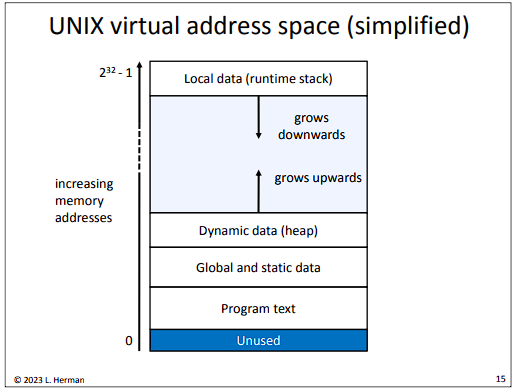

# Lecture 1 Thursday 1/26/2023

## Introduciton

The instructor, Larry Hermon, does not reccommend reading Bryant and O'whateverTheBookIsCalled even though this class is based on that book.

## Motivating Concepts

A bit is a binary digit (Binary digIT -> BIT).
* stored in groups of 8, which are called bytes.

Bytes are stored in groupes of bytes called words.

32-bit machines have 32 wires carrying data between components.
* similarly, 64-bit machines have 64 wires carrying data between components.

The wires (usually 32 or 64 parallel wires) connecting components in a computer is called a bus.

In 32-bit machines, one word is 32 bits, or 4 bytes. 
* similary, 64 bits, 8 bits, one word.

In memory, everythin is just bits. Howe they're treated and interpreted by the computer and its code determines if it's considered an int, char, etc.

Machine language is a series of numbers that tells the computer what to do. It's different for each computer/COU. 
* Machine language is executed sequentially, but some instruction scan make execution go somewhere else, similar to loops or if statements.

Assembly is a human-readable version of machine language
* an Assembler converts assembly to machine language.

High-level languages such as C, Java, Python, etc. are turned into machine language by a compiler.

## Assembly Language Example

``` ruby
        .data
sum:    .word   0               # initialize sum to 0
x:      .word   1               # initialize x to 1

        .text
main:   li      $t3, 1          # store 1 in a register
loop:   lw      $t0, sum        # get the value of sum
        lw      $t1, x          # get the value of x
        add     $t0, $t0, $t1   # add x to sum
        sw      $t0, sum        # update value in memory
        add     $t1, $t1, $t3   # add 1 to x
        sw      $t1, x          # update value in memory
        ble     $t1, 10, loop   # if x <= 10 go back to 'loop'
        
        li      $v0, 1          # print the value of sum
        move    $a0, $t0
        syscall
        
        li $v0, 10
        syscall                 # end of program; stop running
```

In this example:
* `.data` means what comes after this is data
* `#` starts a comment
* `.text` means what comes after th is is code
* `main` and `loop` is the name of the functions

## Hardware Organizaton - Main Components

The main components in a computer are:
* CPU (Central Processing Unit) does all the processing and follows the instructions given to it.
* Memory is a list of locations to memory locations. Each location is word-sized.
* Registers are fast-access locations like a memory location, except registers are located in the CPU. Registers are word sized. Registers are expensive.
* Mass storage (hard drives, SSDs) are the storage most files are stored in a computer long term.
* Remote storage are other computers with usually a lot of mass storage which can be accessed through a network.

## Machine Language Example

The same assembly language shown above, when compiled to machine code, looks like this (in machine code for one particular machine):

``` machine code
87313612910
06702593235
14316801006
70259323514
97220173834
56100670259
32888302592
19613728100
67025932888
36813269002
85553377069
97872546305
53251312872
54631412
```

## The Memory Hierarchy

The memory hierarchy diagram on slide 12 of Larry Herman's Lecture 1 slides shows how some memory can be larger and others can be more expensive.


## The Operating System

The operating system:
* manages the computer's resources
* protects the comptuer from misuse
* provides abstraction and mechanisms so that programs can (safely) manipulate the hardware

## Process

A Process is a running program (one or more threads of control) along with all the data associated with it (an address space)

The OS uses context switching to give a program the illusion that it's the only program running (a program isn't affected by running programs).

## Unix Virtual Addess Space (simplified)

This simplified diagram of the unix virtual address space shows how unix memory works



## Two Versions of a Java Method

Consider these two versions of a Java method

``` Java
public static int sum(int[][] array) {
    int i, j, ans= 0;
    for (i= 0; i < array.length; i++)
        for (j= 0; j < array[i].length; j++)
            ans += array[i][j];
    return ans;
}
```

``` Java
public static int sum(int[][] array) {
    int i, j, ans= 0;
    for (i= 0; i < array.length; i++)
        for (j= 0; j < array[i].length; j++)
            ans += array[j][i]; // the only difference
    return ans;
}
```

There is only one difference between these two methods in the code, and the two methods produce the same result. However, the first method is very much faster than the second one. We'll learn why when we learn about how we allocate and iterate through memory.

## Another Java Method

Consider this other Java method:

``` Java
public static int sumArray(int[] array) {
    int i, sum= 0;
    for (i= 0; i < array.length; i++)
        if (array[i] >= 500)
            sum += array[i];
    return sum;
}
```

This method adds numbers in an array together. 

In a test done in class, sorted arrays were always faster to sum. We'll see why at the end of the semester or something.

## Reek, Chapter 1: A Quick Start with C

C has:

* No classes or objects 
* No notion of a current object 
* No inheritance (or interfaces) 
* No generics 
* No overloading 
* No overriding 
* No reference/object dichotomy 
* No garbage collection 
* No exceptions 
* No library collections (no data structures in the library like the Java Collections Framework)

Other than that, it's just like Java.

C is typically fully compiled (to machine code), and not interpreted or compiled to bytecode like Java is.

* Java is good for programs that should run the same on different machines
* C is good for programs that should run differently on each machine, like an OS.

C facilitates direct manipulation of memory.

## A first C program

Consider this C program and notice how it works:

``` C
#include <stdio.h>

/* a nice C program */

int main(void) {
    int x= 0;
    
    x++;

    printf("Just forget ");
    printf("all about ");
    printf("Java now.\n");

    return 0;
}
```

Things to note: 
* ``` c 
  #include <stdio.h>
  ```
  is like an `import` in Java
* `stdio` is standard input and output so C can use the computer's I/O.
* In c90 C, this is the only way to make a comment:
  ``` c
  /* this is a comment */
  ```
  There are no 
  ``` Java
  // comments like this in C
  ```
* `main()` is where execution starts. It is not a method; it's a funtion.
* `printf()` prints to `stdio`.
* The textbook uses `EXIT_SUCCESS` insted of `return 0`, which is better stylistically, but both are equivalent.
* `/n` is an escape sequence which prints a newline, but it's not "a newline".

## The GCC Compiler

Use gcc by typing `gcc`, some options, and the source file name.
* options:
    * `-g`
    * `-wall` this option will give you warnings of what might be wrong with the c code.
    * `-o filename` this option lets you specify the name of the outputted executable instead of the default `a.out`.

* ex:
    * to compile a program called `program.c`, use this command in the CLI:
      ``` bash
      gcc program.c
      ```
        * this will compile `program.c` into an executable called `a.out`.
    * this is another command to compile a program called `program.c`:
      ``` bash
      gcc -g -Wall program.c -o program.x
      ```
        * this will compile the file `program.c` into an executable called `program.x` while using the options `-g` and `-Wall`.

## Running a Compiled Program

After compiling a program, run it by typing the name of the executable into the CLI. For example:
* run `a.out` by typing into the CLI:
  ``` zsh
  a.out
  ```
* run `program.x` by typing into the CLI:
  ``` zsh
  program.x
  ```

## C filenames

C requires that C programs be written in files which end with `.c`
* ex: `program.c`

End of Today's Lecture